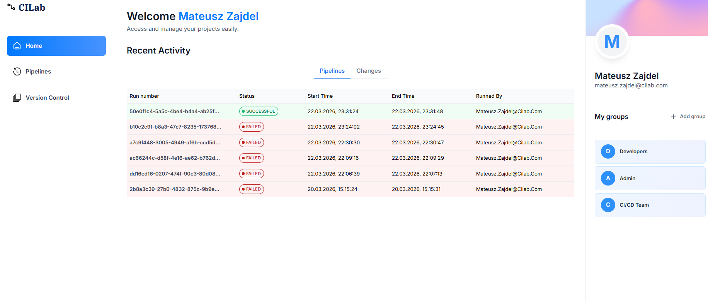
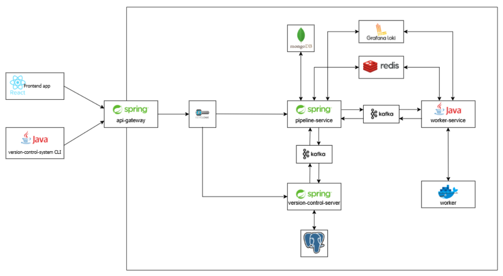
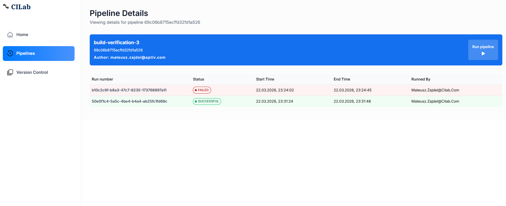
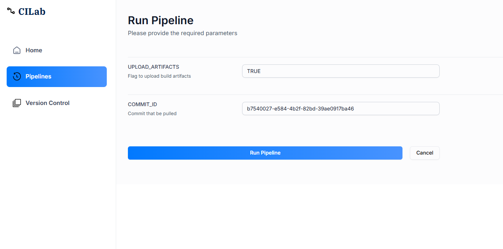
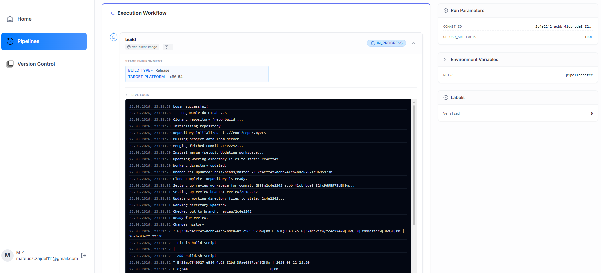
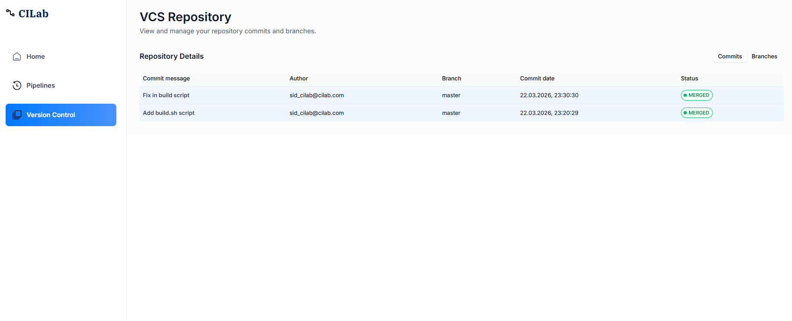
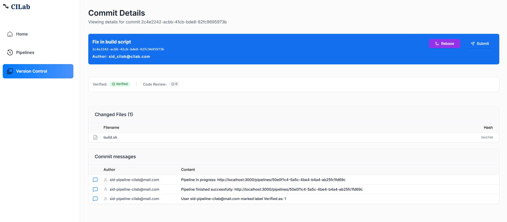

# 🚀 CILab

  

> **CILab** to autorski, rozproszony system CI/CD zintegrowany z własnym systemem kontroli wersji (VCS). Projekt oparty jest na architekturze mikroserwisów i sterowaniu zdarzeniami (Event-Driven Architecture). Umożliwia zarządzanie repozytoriami kodu, automatyczne uruchamianie pipeline'ów w izolowanych kontenerach Docker oraz strumieniowanie logów z etapów budowania na żywo.

Dokument ten opisuje architekturę, zadania modułów aplikacji CILab.

---

## 🛠️ Stack Technologiczny

- **Języki i Frameworki:** Java 21, Spring Boot 3.5.x / 4.0.x (Web, WebFlux, Security, Data JPA, Data MongoDB)
- **Architektura:** Mikroserwisy, Event-Driven, OAuth2 Resource Server
- **Infrastruktura & Messaging:** Apache Kafka, Zookeeper, Docker (docker-java), Docker Compose
- **Bazy danych:** PostgreSQL, MongoDB, Redis
- **Zarządzanie tożsamością:** Keycloak
- **Obserwowalność (Observability):** Loki, Grafana, Redis (SSE strumieniowanie logów)

---

## 🏗️ Architektura Systemu

  

Backend składa się z mikroserwisów uruchamianych przez Docker Compose. Komunikacja odbywa się:
- **synchronicznie** przez HTTP (API za gatewayem),
- **asynchronicznie** przez Kafka (zdarzenia uruchamiania pipeline oraz wyniki),
- przez magazyny danych (MongoDB, PostgreSQL, Redis),
- przez Loki/Grafana dla logów.

Główna infrastruktura wykorzystana w projekcie:
- Kafka + Zookeeper
- MongoDB + Mongo Express
- PostgreSQL + pgAdmin
- Redis + Redis Insight
- Loki + Grafana
- Keycloak

Punkt wejścia: `api-gateway` na porcie 8000.

---

**Kluczowe porty po uruchomieniu:**
- `8000`: api-gateway (Główny punkt wejścia)
- `8001`: pipeline-service (wewnętrznie)
- `8002`: version-control-server (wewnętrznie)
- `8003`: worker-service (wewnętrznie, proces worker)
- `8085`: Keycloak
- `9092`: Kafka
- `27017`: MongoDB
- `5432`: PostgreSQL
- `6379`: Redis
- `3100`: Loki
- `3001`: Grafana

---

## 🧠 Szczegóły techniczne modułów (Deep Dive)

Poniżej znajdują się szczegółowe informacje o implementacji poszczególnych modułów. Rozwiń interesującą Cię sekcję.

<b>🛡️ 1. Moduł: api-gateway</b>

Ścieżka: `./api-gateway`

### Rola
Warstwa wejścia do systemu:
- routing ruchu HTTP do usług wewnętrznych,
- centralna autoryzacja JWT (resource server OAuth2),
- zapewnia punkt wejścia dla frontendu i narzędzi CLI.

### Technologia
- Spring Boot 3.5.x
- Spring Cloud Gateway (WebFlux)
- Spring Security OAuth2 Resource Server

Model wykonania jest reaktywny (WebFlux), co ułatwia obsługę dużej liczby jednoczesnych połączeń i zapytań strumieniowych (np. logi SSE z pipeline-service).

### Routing
W `application.yml` zdefiniowane są trasy:
- `/api/v1/pipelines/**`, `/api/v1/runs/**` -> `pipeline-service:8001`
- `/api/v1/vcs/**` -> `version-control-server:8002`

### CORS
Gateway ma globalną konfigurację CORS dla wszystkich ścieżek.

### Bezpieczeństwo
- Wszystkie requesty (poza OPTIONS) wymagają uwierzytelnienia JWT.
- Konfiguracja JWT oparta o Keycloak.
- Globalny filtr `JwtOffLoadingFilter` odczytuje payload tokenu i dodaje:
    - `X-User-Email`
    - `X-User-Id`
- W przypadku niepoprawnego tokenu / błędu dekodowania payloadu: gateway przerywa request i zwraca 401.

Dzięki temu wewnętrzne mikroserwisy (np. version-control-server) mogą korzystać z danych użytkownika bez samodzielnego dekodowania JWT.

### Przepływ zapytania
1. Klient wysyła request z nagłówkiem `Authorization: Bearer <token>` do api-gateway.
2. Spring Security waliduje JWT na podstawie kluczy publicznych (JWK Set) Keycloak.
3. `JwtOffLoadingFilter` odczytuje claims z payloadu JWT i dopina nagłówki `X-User-Email` oraz `X-User-Id`.
4. Gateway wybiera trasę po Path i przekazuje request do odpowiedniego mikroserwisu.
5. Serwis docelowy korzysta z przekazanych nagłówków i realizuje logikę.

<b>⚙️ 2. Moduł: pipeline-service</b>

Ścieżka: `./pipeline-service`

### Rola
Obsługa CI pipeline:
- CRUD definicji pipeline,
- uruchamianie pipeline,
- monitorowanie runów,
- streaming logów etapów,
- integracja z worker-service i version-control-server przez Kafkę.

pipeline-service trzyma definicje pipeline, inicjuje wykonanie, scala wyniki z workerów i publikuje informacje zwrotne do VCS.

### Zadania domenowe
- Zarządzanie definicjami pipeline.
- Walidacja parametrów runa (parametry requestu + wartości domyślne).
- Uruchomienia pipeline (pipeline run) i monitorowanie statusu.
- Mapowanie wyników etapów/pipeline z eventów Kafka do modelu runa.
- Publikowanie zdarzeń biznesowych do version-control-server (etykiety i komunikaty).
- Udostępnianie strumienia logów etapów dla UI/klienta.

### Technologia
- Spring Boot (Web + WebFlux + Validation)
- Spring Data MongoDB
- Spring Kafka
- Spring Data Redis
- springdoc OpenAPI UI

Kombinacja Web + WebFlux wynika z dwóch typów endpointów:
- klasyczne REST (CRUD i zapytania o runy),
- endpoint strumieniowy SSE dla logów etapów.

### Dane i integracja z innymi mikroserwisami
- MongoDB: definicje pipeline i uruchomienia
- Kafka:
    - publikuje: `pipeline-assigned-events`
    - konsumuje: `pipeline-result-events`, `stage-result-events`, `webhook-events`
    - publikuje do VCS: `pipeline-labels-events`, `pipeline-messages-events`
- Redis + Loki: logi etapów i streaming SSE

### Model pipeline
Pipeline jest modelowany jako graf etapów oparty o poziomy (listy list):
- każdy poziom reprezentuje etapy, które mogą wykonać się równolegle,
- kolejne poziomy startują po zakończeniu poprzednich,
- każdy etap posiada obraz kontenera, skrypt oraz zmienne środowiskowe,
- pipeline może mieć parametry uruchomieniowe.

To umożliwia modelowanie przepływów bez twardego kodowania kolejności w workerze.

### Kroki uruchomienia (run)

1. Klient wywołuje `POST /api/v1/runs/pipelines/{pipelineId}` z parametrami uruchomienia.
2. Serwis pobiera definicje pipeline i waliduje request.
3. Tworzona jest instancja pipeline run ze statusem początkowym.
4. pipeline-service publikuje `pipeline-assigned-events` do Kafka.
5. worker-service konsumuje ten event. Wykonuje etapy i publikuje `stage-result-events` oraz `pipeline-result-events`.
6. pipeline-service konsumuje zdarzenia wynikowe i aktualizuje stan uruchomienia.
7. W zależności od wyniku publikuje zdarzenia do VCS:
    - `pipeline-labels-events`
    - `pipeline-messages-events`

### Integracja webhook -> pipeline
Serwis konsumuje topic `webhook-events`. Pozwala to uruchamiać pipeline automatycznie na zdarzeniach pochodzących z VCS, bez ręcznego uruchamiania.

### API (kontrolery)
Bazowe ścieżki:
- `/api/v1/pipelines`
    - `GET /{id}`
    - `GET /`
    - `POST /`
    - `PUT /{id}`
    - `DELETE /{id}`
- `/api/v1/runs`
    - `POST /pipelines/{pipelineId}`
    - `GET /pipelines/{pipelineId}`
    - `GET /{runId}`
- `/api/v1/pipelines/logs`
    - `GET /{stageId}` (SSE, text/event-stream)

### Opis najważniejszych endpointów
- `POST /api/v1/pipelines`
    - tworzy definicje pipeline, przyjmuje m.in. name, authorEmail, parameters, envVariables, stages, labels, zwraca utworzoną definicje z identyfikatorem.
- `PUT /api/v1/pipelines/{id}`
    - aktualizuje definicje pipeline, utrzymuje ten sam kontrakt danych co create.
- `POST /api/v1/runs/pipelines/{pipelineId}`
    - inicjuje uruchomienie, body to mapa parametrów runtime.
- `GET /api/v1/runs/pipelines/{pipelineId}`
    - zwraca historię uruchomień dla wskazanego pipeline.
- `GET /api/v1/runs/{runId}`
    - zwraca szczegóły pojedynczego uruchomienia i status etapów.
- `GET /api/v1/pipelines/logs/{stageId}`
    - zwraca strumień SSE logów etapu, przeznaczony także do podglądu live w UI.

### Zdarzenia Kafka
Topics używane przez pipeline-service:
- `pipeline-assigned-events`: pipeline-service -> worker-service (zlecenie wykonania runa wraz z etapami i env).
- `stage-result-events`: worker-service -> pipeline-service (status wykonania pojedynczego etapu).
- `pipeline-result-events`: worker-service -> pipeline-service (finalny rezultat całego runa).
- `webhook-events`: version-control-server -> pipeline-service (automatyczny trigger pipeline przez zdarzenie VCS).
- `pipeline-labels-events`: pipeline-service -> version-control-server (zapis etykiet na commit po zakończeniu runa).
- `pipeline-messages-events`: pipeline-service -> version-control-server (przekazanie komunikatu wynikowego np. status CI).

### Logi i obserwowalność

Logowanie etapów działa wielotorowo:
- worker publikuje logi do Redis per kanał etapu,
- pipeline-service nasłuchuje i streamuje logi przez SSE,
- Loki stanowi archiwum logów,
- podejście hybrydowe: historyczne logi pobierane są z Grafana/Loki a live streaming z Redisa.

### Walidacja i jakość danych
- Dane definicji pipeline przechodzą przez warstwę walidacji (Bean Validation).
- Parametry uruchomienia są łączone z wartościami domyślnymi z definicji.

### Zachowanie przy błędach i retry
- Jeżeli worker zgłosi błąd etapu, pipeline run przechodzi w status niepowodzenia.

### Bezpieczeństwo i kontekst użytkownika
pipeline-service jest wywoływany przez api-gateway, który dopina nagłówki `X-User-Email` i `X-User-Id`. Pozwala to mapować uruchomienia i historie na konkretnego autora/użytkownika bez dodatkowego dekodowania JWT w serwisie.

<b>🛠️ 3. Moduł: worker-service</b>

Ścieżka: `./worker-service`

### Rola
Silnik wykonawczy pipeline (worker asynchroniczny):
- konsumpcja zdarzeń przydzielonych pipeline,
- uruchamianie etapów jako zadania Docker,
- publikowanie wyników pipeline i etapów do Kafka,
- publikowanie logów do Redis/Loki.

worker-service jest warstwą wykonawczą CI. Odpowiada za realne uruchamianie kroków pipeline w kontenerach oraz zwracanie wyników do orchestratora.

### Odpowiedzialności domenowe
- Odbiór zadań z Kafka.
- Rozbicie pipeline na etapy i poziomy równoległe.
- Uruchamianie kontenerów dla każdego etapu (obraz + skrypt + env).
- Zbieranie statusów etapów do finalnego statusu pipeline.
- Publikacja zdarzeń wynikowych do Kafka.
- Przesyłanie logów runtime do Redis i Loki.

### Technologia
- Java 21
- docker-java
- Apache Kafka clients
- Jedis (Redis)
- Jackson

Serwis nie wystawia endpointów HTTP.

### Komunikacja i topici
- konsumuje: `pipeline-assigned-events` (group: worker-service-group)
- publikuje: `pipeline-result-events`
- publikuje: `stage-result-events`

### Cykl wykonania pipeline
1. Worker odbiera wiadomość `pipeline-assigned-events`.
2. Tworzy plan wykonania etapów na podstawie przekazanej struktury (poziomy równoległe).
3. Dla każdego etapu uruchamia kontener Docker z odpowiednim obrazem i skryptem.
4. Podczas wykonania publikuje logi etapu.
5. Po zakończeniu etapu emituje `stage-result-events`.
6. Po domknięciu całego runa emituje `pipeline-result-events`.

### Model równoległości i kolejkowania
W implementacji worker korzysta z executora równoległego do obsługi wielu uruchomień i etapów.

### Opis zdarzeń Kafka
- `pipeline-assigned-events`: wejście do workera, zawiera kontekst runa, etapy i zmienne środowiskowe.
- `stage-result-events`: wyjście z workera dla pojedynczych etapów, zawiera status etapu i dane diagnostyczne.
- `pipeline-result-events`: wyjście finalne dla całego uruchomienia, zawiera finalny status i podsumowanie runa.

### Integracja z Docker
worker-service używa biblioteki `docker-java` do komunikacji z daemonem. W docker-compose montowany jest socket `/var/run/docker.sock`, co pozwala workerowi tworzyć i uruchamiać kontenery etapów.

### Logowanie i observability
- Logi etapów są publikowane jako zdarzenia do Redis (kanały per stage).
- Loki służy jako centralne archiwum logów.
- pipeline-service streamuje te logi do klientów przez SSE.
  Efekt: uzyskujemy jednocześnie live tailing oraz trwałe logi.

<b>📂 4. Moduł: version-control-server</b>

Ścieżka: `./version-control-server`

### Rola

Serwer domeny VCS:
- obsługa synchronizacji obiektów repozytorium (push/pull),
- zapytania o repozytoria/commity/branche,
- workflow review (submit/rebase),
- zapisywanie etykiet i wiadomości po wynikach pipeline,
- utrzymanie trwałego storage obiektów VCS.

version-control-server łączy klasyczne API zapytań i historię repozytorium z warstwą synchronizacji obiektów oraz mechanizmami review i integracji CI.

### Zadania domenowe
- Zarządzanie metadanymi repozytorium (repo, branche, commity, relacje).
- Obsługa synchronizacji obiektów między klientem CLI a serwerem (push/pull).
- Udostępnianie API query do przeglądania historii.
- Obsługa procesu review (submit/rebase) i walidacji stanu zmian.
- Integracja eventowa z pipeline-service (trigger webhook i odbiór wyników CI).
- Utrzymanie trwałego storage obiektów.

### Technologia
- Spring Boot 4.0.x
- Spring Web MVC
- Spring Data JPA
- PostgreSQL
- Spring Kafka
- springdoc OpenAPI UI

### Dane i storage

- PostgreSQL: metadane VCS (repo, branche, commity, review, etc.)
- VCS_STORAGE_PATH: magazyn obiektów (w compose mapowany do wolumenu vcs_data_volume)

Rozdzielenie danych:
- PostgreSQL przechowuje metadane i relacje,
- storage obiektów przechowuje surowe obiekty zawartości repo (bloby/drzewa).

### Architektura API
API ma trzy główne grupy odpowiedzialności:
- synchronizacja klient-serwer (push/pull),
- query i eksploracja historii,
- workflow review i adnotacje CI.
  Prefix wszystkich endpointów: `/api/v1/vcs`

### API (prefix: /api/v1/vcs)

Synchronizacja:
- `POST /repo/{repoName}/push-init`
- `POST /repo/{repoName}/push-objects` (application/zip)
- `GET /repo/{repoName}/pull?target=...`

Zapytania i eksploracja:
- `GET /repos`
- `GET /repos/{repoId}/commits`
- `GET /commits/{commitId}`
- `GET /repos/{repoId}/branches`
- `GET /commits/{commitId}/diff`
- `GET /files/{blobHash}`
- `GET /branches/{branchId}/file-tree`

Review i adnotacje:
- `POST /submit/{commitId}`
- `POST /rebase/{commitId}?branch=master`
- `POST /labels` (wymaga X-User-Email)

### Endpointy API
- `POST /repo/{repoName}/push-init`: negocjacja push i ustalenie brakujących obiektów (request: metadane push, response: lista obiektów oczekiwanych).
- `POST /repo/{repoName}/push-objects`: dosłanie brakujących obiektów (application/zip), serwer zapisuje obiekty do storage.
- `GET /repo/{repoName}/pull?target=...`: pobranie brakujących obiektów potrzebnych do targetu (strumień zip).
- `GET /repos`: lista repozytoriów widocznych dla użytkownika/systemu.
- `GET /repos/{repoId}/commits`: historia commitów wskazanego repo.
- `GET /commits/{commitId}`: szczegóły pojedynczego commita.
- `GET /repos/{repoId}/branches`: lista branchy i ich wskazań.
- `GET /commits/{commitId}/diff`: lista zmian plikowych dla commita.
- `GET /files/{blobHash}`: pobranie zawartości pliku po hashu (skompresowane/gzip payload).
- `GET /branches/{branchId}/file-tree`: drzewo plików dla wskazanego brancha.
- `POST /submit/{commitId}`: zgłasza commit do review (wykorzystuje kontekst `X-User-Email`).
- `POST /rebase/{commitId}?branch=master`: wykonuje rebase commita na wskazany branch.
- `POST /labels`: zapisuje etykietę CI/review dla commita (wykorzystywane przez pipeline-service).

### Przepływy domenowe
#### Push (high-level)
1. Klient wywołuje push-init i dostaje listę brakujących obiektów.
2. Klient wysyła brakujące obiekty przez push-objects (zip).
3. Serwer utrwala obiekty i aktualizuje metadane referencji/commitów.

#### Pull (high-level)
1. Klient wskazuje repo i target (branch/commit).
2. Serwer wylicza manifest potrzebnych obiektów.
3. Serwer streamuje zip z obiektami do klienta.

#### Review + CI
1. Użytkownik submituje commit do review.
2. version-control-server publikuje webhook-events.
3. pipeline-service uruchamia pipeline i publikuje wyniki labels/messages.
4. version-control-server konsumuje wyniki i aktualizuje status/adnotacje commita.

### Kafka
- producent: `webhook-events`
- konsumuje: `pipeline-labels-events`, `pipeline-messages-events`

### Zdarzenia Kafka
- `webhook-events`: version-control-server -> pipeline-service (automatyczne uruchomienie pipeline po zdarzeniu review).
- `pipeline-labels-events`: pipeline-service -> version-control-server (aktualizacja etykiet na commit/review).
- `pipeline-messages-events`: pipeline-service -> version-control-server (zapis komunikatu CI).

<b>💻 5. Moduł: version-control-client</b>

Ścieżka: `./version-control-client`

### Rola
Klient CLI VCS (narzędzie deweloperskie):
- operacje lokalne na repozytorium,
- komunikacja z version-control-server po HTTP,
- logowanie przez Keycloak i obsługa tokenu.

### Technologia
- Java 21
- Jackson
- Java HttpClient
- Maven Shade Plugin (fat jar, Main-Class: `org.example.MyVCSClient`)

### Dostępne komendy CLI
Uruchomienie bez argumentów wypisuje listę dostępnych komend.

### Jak działa klient (high-level)
- Komendy lokalne operują na katalogu `.myvcs` (commity, index, refs, obiekty).
- Komendy sieciowe korzystają z `VCS_SERVER_URL` i tokenu z `TOKEN_FILE_PATH`.
- Brak tokenu powoduje błąd sesji i wymaga wykonania login.

Lokalny katalog `.myvcs` przechowuje m.in.:
- `commits/` (metadane commitów JSON)
- `objects/` (bloby skompresowane GZIP)
- `refs/heads/` (branche)
- `HEAD`, `FETCH_HEAD`, `index`, `remote`

### Komendy szczegółowo

#### 1) login
Składnia: `myvcs login --email <mail> --password <haslo>`
Co robi:
- Wysyła request password grant do Keycloak (`KEYCLOAK_URL`) z `CLIENT_ID`.
- Odczytuje `access_token` z odpowiedzi.
- Zapisuje token do `TOKEN_FILE_PATH`.

#### 2) init
Składnia: `myvcs init [path] [repo_name]`
Co robi:
- Inicjalizuje repozytorium lokalne (`.myvcs`).
- Tworzy katalogi commits, objects, refs/heads.
- Ustawia HEAD na ref: `refs/heads/master`.
- Ustawia nazwę zdalnego repo w pliku remote.

#### 3) clone
Składnia: `myvcs clone <repository_name>`
Co robi:
- Sprawdza, czy w bieżącym katalogu nie ma już `.myvcs`.
- Wykonuje lokalne `init(".", repoName)`.
- Następnie wykonuje pull master bez trybu rebase.

#### 4) add
Składnia: `myvcs add <file1> [file2] [...]`
Co robi:
- Dla każdej ścieżki wylicza hash SHA-1 zawartości.
- Zapisuje blob do `.myvcs/objects` (GZIP).
- Aktualizuje index: ścieżka -> hash blobu.

#### 5) commit
Składnia: `myvcs commit "message"`
Co robi:
- Odczytuje index (staging).
- Tworzy commit z nowym UUID oraz `parentId` ustawionym na aktualny HEAD.
- Zapisuje commit lokalnie i aktualizuje ref bieżącego brancha/HEAD.

#### 6) log
Składnia: `myvcs log`
Co robi:
- Startuje od HEAD i idzie po `parentId` wstecz.
- Wypisuje commitId, datę, message i dekoracje branch/HEAD.
- Pokazuje historię lokalną dostępną w `commits/`.

#### 7) checkout
Składnia: `myvcs checkout <branch_name_or_commit_hash>`
Co robi:
- Rozwiązuje target jako branch lub commit.
- Sprawdza konflikty z niezatwierdzonymi zmianami / plikami nie śledzonymi.
- Podmienia pliki robocze do stanu docelowego commita.
- Ustawia HEAD na branch (attached) albo bezpośrednio na commit (detached).

#### 8) branch
Składnia: `myvcs branch <branch_name>`
Co robi:
- Tworzy `refs/heads/<branch_name>` wskazujący na aktualny HEAD.

#### 9) merge
Składnia: `myvcs merge <branch_or_ref>`
Co robi:
- Rozwiązuje target i próbuje zintegrować z bieżącym HEAD.
- Obsługuje 3 scenariusze:
    - initial merge (gdy lokalny HEAD jest pusty),
    - fast-forward,
    - 3-way merge z merge-base.
- Przy poprawnym 3-way merge tworzy commit mergujący (`secondParentId` ustawiony).

#### 10) push
Składnia: `myvcs push [branch_name] [--review]`
Co robi:
- Określa branch docelowy (podany w argumencie lub aktualny z HEAD).
- Buduje target ref:
    - `refs/heads/<branch>` (normalny push),
    - `refs/for/<branch>` (tryb review z `--review`).
- Wykonuje push-init i dostaje listę brakujących obiektów.
- Pakuje brakujące obiekty do ZIP i wysyła push-objects.

#### 11) fetch
Składnia: `myvcs fetch [target]`
Co robi:
- Pobiera dane z serwera dla targetu (branch/commit).
- Rozpakowuje zip i zapisuje obiekty/commity lokalnie.
- Ustawia `FETCH_HEAD` na pobrany commit.
- Nie modyfikuje automatycznie bieżącego brancha.

#### 12) pull
Składnia: `myvcs pull [target] [--rebase]`
Co robi:
- Najpierw wykonuje fetch(target).
- Potem integruje zmiany:
    - domyślnie merge,
    - z `--rebase`: rebase aktualnego HEAD na fetched commit.

#### 13) rebase
Składnia: `myvcs rebase <upstream_branch>`
Co robi:
- Wykonuje 3-way rebase bieżącego commita na upstream branch.
- Przy sukcesie tworzy nowy commit rebased i przesuwa HEAD.
- Przy braku różnic zwraca already up to date.

#### 14) checkout-review
Składnia: `myvcs checkout-review <commit_hash>`
Co robi:
- Pobiera wskazany commit z serwera (fetch po commitId).
- Tworzy lokalny branch `review/<shortCommitId>`.
- Wykonuje checkout na ten branch i przygotowuje workspace do review.

### Kolejność pracy (rekomendowana)
1. `myvcs login`
2. `myvcs init` albo `myvcs clone`
3. `myvcs add` -> `myvcs commit`
4. `myvcs push` (opcjonalnie `--review`)
5. `myvcs fetch/pull` do synchronizacji

